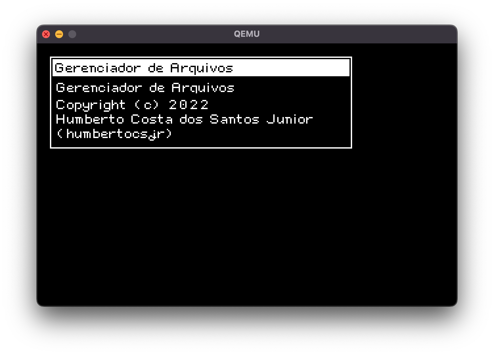
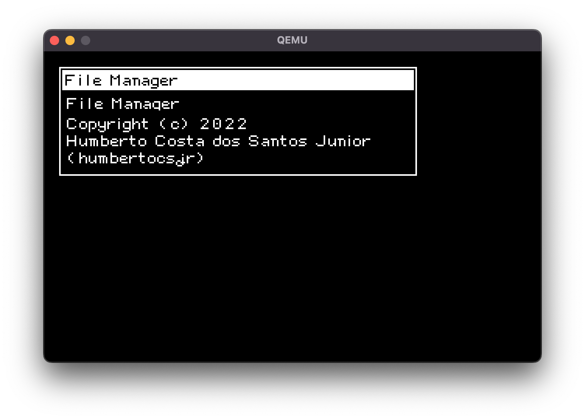

# HUSIS

Sistema Operacional para PC/XT e compatíveis.

## Captura de telas
#### Português do Brasil

#### Inglês Americano



## Versões

- 0.2.0 - 25/08/2022 - Interface Gráfica
  - Implementação da Biblioteca de Video entre o Controlador de Vídeo e a Interface Gráfica, a Biblioteca implementa rotinas não otimizadas que podem ser substituidas por rotinas otimizadas do Controlador de Vídeo, facilitando a implementação de novos controladores, bastando implementar o desenho de pixel para conseguir funcionar
  - Criado o primeiro Controlador de Video CGA, por enquanto apenas foi implementado a rotina de desenhar um pixel, e esta de forma não otimizada, usando a BIOS, sendo assim o desempenho é bem lento.
  - Implementado a renderização de fontes simples, aproveitando a importação da Fonte Paçoca vinda do antigo projeto HCSO.

- 0.1.3 - 24/08/2022 - Melhorias na Extensão Interface e criação do primeiro aplicativo
  
  - Prototipado versão modo texto de alta resolução e resolução normal
  
  - Criação do protótipo do Programa 'Arquivos'
  
  - Implementação de sub controles dentro de outros controles
  
  - Melhoria na importação permitindo importar módulos de programas já abertos

- 0.1.2 - 22/08/2022 - Implementado a importação de módulos do núcleo para programas
  
  - Adição de rotinas de comparação de texto
  
  - Implementado a importação de módulos do nucleo por programas comuns

- 0.1.1 - 21/08/2022 - Versão inicial
  
  - Criação da multitarefa
  
  - Implementado terminal de texto com saidas diversas para uso do núcleo
  
  - Criação do Gerenciamento de Memória que divide a RAM em blocos de 256 Bytes
  
  - Início da implementação do MinixFS


## Licenciamento

Este software é licenciado via BSD-4 Clause, o que torna incompatível com código GPL.

Exigindo que qualquer derivado informe explicitamente a origem do código.


## Motivação

Sempre tive interesse em Sistemas Operacionais e Assembly, como tenho uma pequena coleção de computadores antigos, resolvi desenvolver mirando no minimo em comum entre parte da minha coleção, a plataforma PC/XT, tenho como objetivo desenvolver um sistema leve e simples que possa ser rodado em vários hardwares com processador 8088/8086 e derivados.

Quero ao menos tentar faze-lo compacto o suficiente para rodar no meu HP 95LX (Processador 8088 com 256 KiB de RAM e 256 KiB de armazenamento), mas não é o objetivo obrigatório deste projeto, pois estou mirando em computadores como IBM XT com 512 KiB de RAM e 5 MiB de Armazenamento.


## Objetivos

#### Imediatos

- Implementar completamente o MinixFS

- Permitir que o núcleo carregue de forma simples executáveis e bibliotecas

- Ampliar os módulos de uso geral que ficam no núcleo: Texto e Caractere

- Implementar a Interface Gráfica

- Implementar controlador de Mouse Serial e PS/2

- Implementar comunicação serial

- Implementar Video CGA (Preto e Branco)

#### Não prioriários

- Terminar o porte para assembly do TinyASM, permitindo que o HUSIS possa se compilar e compilar programar de dentro dele.

- Implementar um interpretador BASIC simples para quem não tem conhecimento de Assembly

- Implementar comunicação TCP/IP via SLIP

- Implementar Video VGA e EGA

- Criar uma ferramenta de instalação em disco

#### Longo Prazo

- Implementar Controlador NE2000

- Implementar ATAPI

- Implementar um gerador de discos automático e personalizável podendo escolher os programas e extensões


## Inspiração

Tenho como inspiração alguns sistemas operacionais, tais como:

- Minix - Por ser muito compacto e leve, de onde tirei o sistema de arquivos MinixFS

- SymbOS - Por conseguir um ambiente multitarefas gráfico em um ambiente tão limitado quanto o que estou criando, o processador 8080/Z80

- MacOS/System - Pela forma de organizar o sistema operacional, tanto interface gráfica simplificada quanto hierarquia de diretórios bem simples de usar

- Windows 3.x - Um pouco da estilização gráfica e no geral o que não fazer com um sistema operacional, tudo que o Windows complicou quero simplificar nesse projeto

- HaikuOS - Da mesma forma que me inspirei no MacOS, simplificar tudo ao maximo para ser leve, rápido e funcional

Com essa mistura quero fazer um sistema com o mínimo de APIs possível para ser funcional, ao mesmo tempo que não ignoro o necessário para ser fácil de criar aplicações.


## Escopo

- Criar um Sistema Operacional para 8086/8088.

- Usando apenas interface gráfica (Inspirada no MacOS, HaikuOS e Windows 3.x, nesta ordem), com uma barra superior, um dock para acesso rápido.

- Simples porém expansível, implementando o básico de cada funcionalidade mas mantendo sempre APIs expansíveis para poder ligar extensões externas. (Como suporte a outros Sistema de Arquivos ou Dispositivos de Armazenamento).

- (Semi)Orientado a Objetos, limitada devido a escolha da linguagem de programação, porém o código usa e abusa de objetos dinamicamente alocados e classes estáticas para a parte principal do código.

- Manter o núcleo o mais enxuto possível, sempre tentando manter o máximo de funcionalidades em extensões externas.


## Armazenamento de Arquivos/Diretórios

Inspirado no MacOS/System e no HaikuOS, os diretórios seguem uma hierarquia rígida porém simples de usar, onde todos os arquivos de um mesmo propósito ficam juntos.

Para acelerar o desenvolvimento, a camada de Sistema de Arquivos Virtual é bem simplificada, não permitindo montar unidades dentro de outras, sendo mais parecido com o MacOS Classico ou Windows, utilizando um esquema numérico para classificar as unidades, ao invés de letras como no Windows.

O formato de endereço de um item no disco segue o padrão abaixo

**[UNIDADE]/DIRETORIO/DIRETORIO/ITEM**

Exemplo:

```
[0]/Sistema/Config.cfg
```

Caso não seja fornecida a unidade, será utilizada automaticamente a unidade principal, onde fica o sistema operacional.


## Hierarquia

Por padrão os arquivos são armazenados nos diretórios abaixo, e seus nomes são traduzídos juntamente do sistema operacional.

| PT-BR                    | EN-US                      | Descrição                                                       |
| ------------------------ | -------------------------- | --------------------------------------------------------------- |
| /Sistema                 | /System                    | Armazena os arquivos do Sistema Operacional                     |
| /Sistema/Extensoes       | /System/Extensions         | Extensões do núcleo do Sistema Operacional                      |
| /Sistema/Config          | /System/Config             | Arquivos de configuração globais                                |
| /Perfis/[USUARIO]        | /Profiles/[USUARIO]        | Diretórios do Usuário                                           |
| /Perfis/[USUARIO]/Config | /Profiles/[USUARIO]/Config | Arquivos de configuração do usuário                             |
| /Programas               | /Programs                  | Programas Gerais instalados                                     |
| /Desenvolvimento         | /Development               | Programas e ferramentas voltadas ao desenvolvimento de software |


# Parte Técnica

## Sistema de Arquivos

Para armazenamento foi escolhido o MinixFS na sua versão 1 (30), assim unindo uma facilidade no desenvolvimento, por ser um sistema de arquivos simples voltado a maquinas da época do PC/XT e ser amplamente suportado pelo Linux e por ferramentas como [MinixFS](https://github.com/humbertocsjr/minixfs) que pode ser usada em MacOS/Linux/Windows para criar e manipular imagens.

Ao escolher uma versão específica desse sistema de arquivos, facilita o seu desenvolvimento, abaixo listo os prós e contras desta versão:

- Limite de 30 caracteres no nome de arquivo

- Tamanho máximo da partição/disco de 64 MiB (O Sistema Operacional inteiro cabe em uma partição com todos os arquivos, tendo em vista que executáveis grandes tem 10-20 KiB de tamanho)

- Permite armazenar uma hierarquia complexa de diretórios de forma que é simples de ler e processar suas entradas

- Não tem camadas adicionais de complexidade como o FAT (Para nomes longos) ou ExtFS (Que tem extensões complexas de processar em um 8086).

- Trabalha inteiramente em 16 bits, facilitando e acelerando o processamento

## Metodologia

Foi escolhida como linguagem principal o Assembly (Padrão NASM), por esta linguagem ser muito livre em forma, não exigindo um padrão especifico de desenvolvimento ou mesmo método, foi criado um padrão de codificação para este projeto, visando unificar todo o código fonte e simplificar sua manutenção, e por ser um padrão simples, facilitar a inclusão de novo código.


### (Quase)Orientação a Objetos

Para diminuir o tamanho dos executáveis e facilitar o reaproveitamento de código entre projetos, os programas são divididos em Modulos (Simulacro de Classes Estáticas) e Objetos (Similar a uma Classe), foi feito de uma forma, que deixa a responsabilidade para o sistema operacional lidar com a alocação e gerenciamento dos segmentos do 8086.


### Segmentação de memória

Para simplificar o gerenciamento da memória, o HUSIS disponibiliza um Módulo de Gerenciamento de Memória, que pode ser usado para alocar e liberar trechos de até 64 KiB por vez, não havendo limite de quantos trechos um aplicativo pode ter e qual o uso deles.

A memória é dividida em Local, Remoto e Estático, onde os dois primeiros são gerenciadas pelo Sistema Operacional, e o último é interno do programa, abaixo segue detalhamento:

- Local - Todas as funções com este nome utilizam o Ponteiro DS:SI para manipular o dado desejado

- Remoto - Utiliza o Ponteiro ES:DI para manipular o dado desejado.

- Estático - Utiliza os Ponteiros CS:SI ou CS:DI dependendo do contexto para manipular o dado desejado

Esta separação é para acomodar os Ponteiros disponíveis pelo Processador, e facilitar a programação, pois sempre a função terá em seu nome qual ponteiro ela usa, por exemplo:

- Memoria.AlocaLocal - Aloca um trecho da memória usando DS:SI

- Memoria.AlocaRemoto - Aloca um trecho da memória usando ES:DI

- Memoria.CopiaLocalRemoto - Copia um conteúdo de DS:SI para ES:DI

- Memoria.CopiaLocalEstatico - Copia um conteúdo de DS:SI para CS:DI

A memória é organizada em blocos de 256 Bytes, mas isto é transparente para o programador do aplicativo, que pode opcionalmente usar metodor de alocação que usem blocos ao invés de bytes, para otimizar o código caso seja um projeto muito grande. 


## Chamadas

Todo código deve usar chamadas do tipo CALL FAR entre rotinas, assim podendo chamar códigos de outros executáveis.


